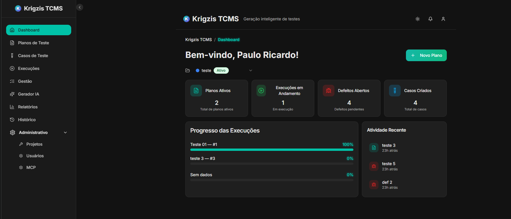

# Krigzis-TCMS - Sistema de Gestão de Casos de Teste

## Sobre o projeto

**Krigzis-TCMS** é um sistema de gestão de casos de teste (Test Case Management System) com funcionalidades avançadas de IA. Plataforma moderna construída com React, TypeScript, Supabase e integração multi-provedor de IA (Gemini, OpenAI, Anthropic, Groq, Ollama).



### Funcionalidades Principais

 - **Gestão Completa de Testes**: Planos, Casos e Execuções
 - **IA Generativa**: Geração automática via múltiplos provedores
 - **Relatórios Avançados**: Dashboard com métricas em tempo real
 - **Segurança**: RLS do Supabase + Edge Functions
 - **UI Moderna**: shadcn/ui + Radix UI + Tailwind CSS

## 🚀 Instalação e Configuração

### Pré-requisitos
- **Node.js 18+** e npm (recomendado via [nvm](https://github.com/nvm-sh/nvm))
- **Projeto Supabase** configurado (veja [docs/01-configuracao](docs/01-configuracao/))

### 1️⃣ Configuração Local

```bash
# Clone o repositório
git clone https://github.com/PauloHYBEX/Krigzis-TCMS.git
cd Krigzis-TCMS

# Instale as dependências
npm install

# Configure as variáveis de ambiente
cp scripts/env.example .env.local

# Edite .env.local com suas chaves do Supabase:
# VITE_SUPABASE_URL=https://seu-projeto.supabase.co
# VITE_SUPABASE_ANON_KEY=sua-chave-anonima
# VITE_SINGLE_TENANT=false

# Inicie o servidor de desenvolvimento (porta 8080)
npm run dev
```

### 2️⃣ Configuração do Supabase

**IMPORTANTE**: Execute o SQL de configuração no seu projeto Supabase antes de usar:

1. Acesse o [Supabase Dashboard](https://supabase.com/dashboard)
2. Vá em **SQL Editor** → Nova Query
3. Execute o conteúdo completo de `docs/01-configuracao/CONFIGURACAO_SUPABASE.md`
4. Configure **Authentication** → **Settings**:
   - Site URL: `http://localhost:8080`
   - Redirect URLs: `http://localhost:8080/**`

### 3️⃣ Scripts Disponíveis

- `npm run dev` - Servidor de desenvolvimento (porta 8080)
- `npm run build` - Build de produção
- `npm run preview` - Preview do build
- `npm run lint` - Validação ESLint

**Editar um arquivo diretamente no GitHub**

- Navegue até o(s) arquivo(s) desejado(s).
- Clique no botão "Edit" (ícone de lápis) no canto superior direito da visualização do arquivo.
- Faça suas alterações e confirme o commit.

**Usar GitHub Codespaces**

- Acesse a página principal do seu repositório.
- Clique no botão "Code" (botão verde) no canto superior direito.
- Selecione a aba "Codespaces".
- Clique em "New codespace" para iniciar um novo ambiente Codespace.
- Edite os arquivos diretamente no Codespace e faça commit/push quando terminar.

## 🛠️ Stack Tecnológico

### Frontend
- **React 18.3+** - Framework principal
- **TypeScript** - Tipagem estática
- **Vite** - Build tool e dev server
- **Tailwind CSS** - Styling utilitário
- **shadcn/ui** - Componentes UI modernos
- **Radix UI** - Primitivos de UI acessíveis
- **React Query** - Gerenciamento de estado server
- **React Router** - Roteamento SPA

### Backend & Infraestrutura
- **Supabase** - BaaS (PostgreSQL + Auth + Edge Functions)
- **PostgreSQL** - Banco de dados principal
- **Edge Functions** - Processamento serverless
- **Row Level Security (RLS)** - Segurança nativa

### IA & Integrações
- **Google Gemini** - Modelos Gemini 1.5/2.0
- **OpenAI** - GPT models
- **Anthropic** - Claude models  
- **Groq** - LLaMA models
- **Ollama** - LLMs locais
- **Zod** - Validação de schemas

## 🤖 Configuração da IA (MCP - Model Control Panel)

O sistema suporta múltiplos provedores de IA. Configure suas chaves API via interface:

1. Acesse `/model-control` (requer permissão `admin`)
2. Adicione seus modelos e chaves API
3. Configure templates de prompts personalizados
4. Teste conectividade antes de usar

### Provedores Suportados
- **Gemini**: Requer chave da Google AI Studio
- **OpenAI**: Requer chave da OpenAI API
- **Anthropic**: Requer chave da Anthropic API
- **Groq**: Requer chave da Groq API
- **Ollama**: Requer servidor local rodando

## ⚡ Edge Functions (Opcional)

Para funcionalidades avançadas como convite de usuários:

```bash
# Configure o Supabase CLI
supabase login
supabase link --project-ref mhhzdykyjgrnprcyhlbz

# Configure os secrets
supabase functions secrets set \
  --project-ref mhhzdykyjgrnprcyhlbz \
  SUPABASE_URL="https://mhhzdykyjgrnprcyhlbz.supabase.co" \
  SUPABASE_ANON_KEY="sua-anon-key" \
  SUPABASE_SERVICE_ROLE_KEY="sua-service-role-key"

# Deploy das funções
supabase functions deploy invite-user --project-ref mhhzdykyjgrnprcyhlbz
supabase functions deploy delete-user --project-ref mhhzdykyjgrnprcyhlbz
```

## 📚 Documentação Completa

Documentação consolidada (fonte de verdade) em `docs/`:

- **Guia do Sistema** – visão, arquitetura, módulos, permissões, IA, APIs
  - [docs/01-Guia-do-Sistema.md](docs/01-Guia-do-Sistema.md)
- **SQL — Banco de Dados (Supabase)** – setup, RLS, scripts e troubleshooting
  - [docs/02-SQL-e-Banco-de-Dados.md](docs/02-SQL-e-Banco-de-Dados.md)
- **Historiologia de Desenvolvimento** – histórico, diagnósticos, plano de ação
  - [docs/03-Historico-e-Planos.md](docs/03-Historico-e-Planos.md)

Conteúdo legado/referência histórica permanece listado em:
- [docs/README.md](docs/README.md)

## 🚀 Deploy

### Vercel/Netlify
1. Conecte seu repositório GitHub
2. Configure variáveis de ambiente:
   ```
   VITE_SUPABASE_URL=https://seu-projeto.supabase.co
   VITE_SUPABASE_ANON_KEY=sua-chave-anonima
   VITE_SINGLE_TENANT=false
   ```
3. Build command: `npm run build`
4. Output directory: `dist`

### Manual
```bash
npm run build
# Deploy o conteúdo da pasta dist/
```

## 🔧 Desenvolvimento

### Estrutura do Projeto
```
src/
├── components/        # Componentes React reutilizáveis
├── pages/            # Páginas da aplicação
├── hooks/            # Custom hooks
├── services/         # Lógica de negócio e APIs
├── integrations/     # Integrações (Supabase, IA)
├── lib/              # Utilitários e helpers
└── types/            # Definições TypeScript

supabase/
├── migrations/       # Migrations do banco
└── functions/        # Edge Functions
```

### Scripts de Qualidade
```bash
npm run lint          # ESLint
npm run build         # Build de produção
npm run preview       # Preview do build
```
